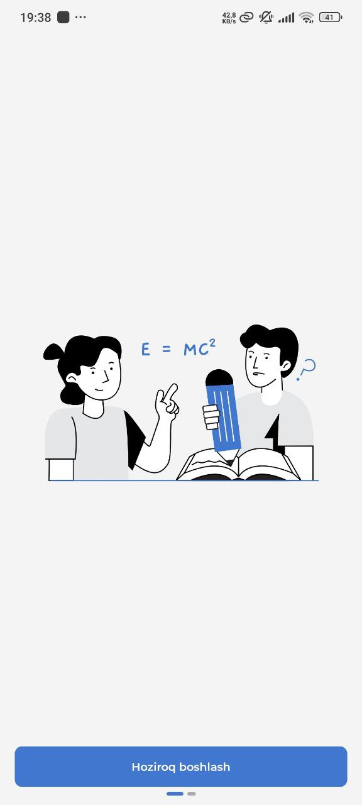

# O'qituvchilar Reytingi Ilovasi ⭐

Bu ilova universitetdagi o‘qituvchilarning reytingini yuritish uchun mo‘ljallangan. Talabalar o‘qituvchilarni izlab topishi, ular haqida ma’lumot olishi va baho berishi mumkin.

---

## 📌 Xususiyatlar

✅ **API orqali o‘qituvchilar ro‘yxatini yuklash** – Ilova universitetdagi o‘qituvchilarning ro‘yxatini API orqali oladi.

✅ **Qidiruv funksiyasi** – Talabalar o‘qituvchilarni fani va ismi bo‘yicha qidirishi mumkin.

✅ **O‘qituvchi profili** – Har bir o‘qituvchi haqida asosiy ma’lumotlar (ismi, fani, universiteti) ko‘rsatiladi.

✅ **Reyting tizimi** – Talabalar o‘qituvchilarga baho bera oladi va ularning umumiy reytingi shakllantiriladi.

---

## 🛠️ Texnologiyalar

Ilovada quyidagi texnologiyalar ishlatilgan:

- **Android (Jetpack Compose)** – Ilovaning UI qismini yaratish uchun
- **Kotlin** – Asosiy dasturlash tili
- **Firebase Authentication** – Foydalanuvchi autentifikatsiyasi uchun
- **Firebase Firestore** – Ma’lumotlarni saqlash uchun
- **Koin** – Dependency Injection
- **Voyager** – Navigation boshqaruvi uchun

---

## 🚀 Ilova qanday ishlaydi?

1️⃣ **O‘qituvchilar ro‘yxati yuklanadi** – Ilova API orqali universitetdagi barcha o‘qituvchilar ro‘yxatini oladi va ekranda ko‘rsatadi.

2️⃣ **Qidiruv funksiyasi** – Talabalar o‘qituvchilarni ismi yoki fani bo‘yicha qidirishi mumkin.

3️⃣ **O‘qituvchi haqida ma’lumot** – Har bir o‘qituvchining shaxsiy profili mavjud bo‘lib, unda ismi, fani va universiteti haqida ma’lumot beriladi.

4️⃣ **Reyting berish** – Talabalar o‘qituvchiga yulduzcha (⭐) orqali baho bera oladi. Har bir baho umumiy reytingga qo‘shiladi.

---

## 📂 Loyihani ishga tushirish

1️⃣ **Repository’ni klonlash:**
```bash
git clone https://github.com/username/teachers-rating-app.git
cd teachers-rating-app
```

2️⃣ **Android Studio’da ochish**

3️⃣ **Firebase konfiguratsiyasini sozlash** – `google-services.json` faylini loyihaga qo‘shing.

4️⃣ **Ilovani ishga tushirish:**
Run → Run 'app' tugmasini bosib, ilovani emulator yoki real qurilmada ishga tushiring.

---
**Asosiy ekran:**


## 📞 Aloqa
Agar sizda savollar yoki takliflar bo‘lsa, quyidagi manzillar orqali bog‘lanishingiz mumkin:

📧 Email: a.toshmatov.dev@gmail.com  
🌐 GitHub: [GitHub Profilingiz](https://github.com/atoshmatov)

---

🚀 **O‘qituvchilar reytingi ilovasi** – ta’lim sifatini oshirishga qaratilgan qulay va samarali platforma!

